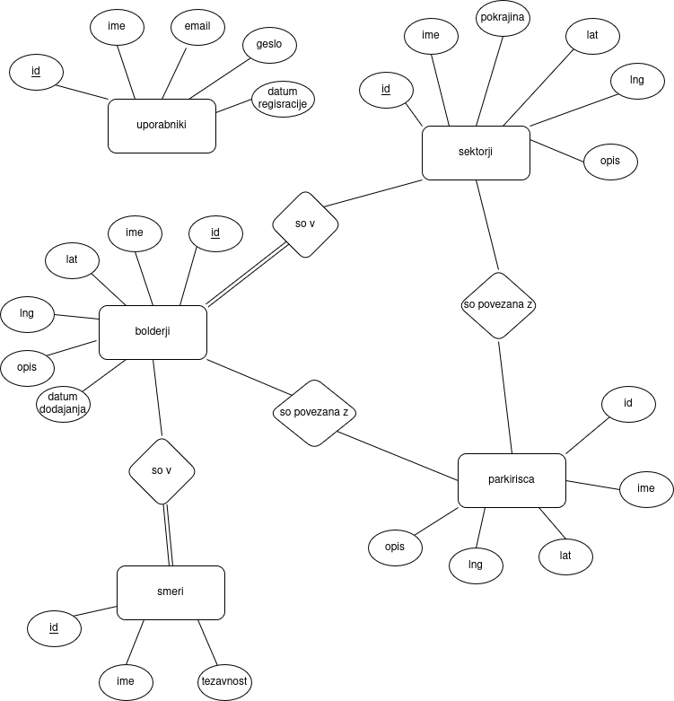

# BolderRadar

Zagon projekta: 

Za športno plezanje z vrvjo po naravni skali obstaja mnogo dobro zbranih vodničkov. Za plezanje po bolderjih ali balvanih pa (vsaj v Sloveniji) ni zbranih in urejenih plezališč na enem mestu. Zato ta aplikacija Bolder Radar.

Prijavi se lahko vsak. Na domači strani je zemljevid, na katerem so označeni sektorji. Preko sektorjev se dostopa do posamezih bolderjev v njih in tudi do parkirišč, ki so blizu. Vsak, ki se prijavi, lahko dodaja bolderje v aplikacijo. Tako pri bolderjih kot tudi pri sektorjih in parkiriščih so zaželjeni podrobni opisi dostopa, izgleda in ostalih informacij, ki zelo pomagajo pri iskanju.

Um ja so far, vprašaj za mnenje, kaj morda še dodat/popravt

# ER diagram

